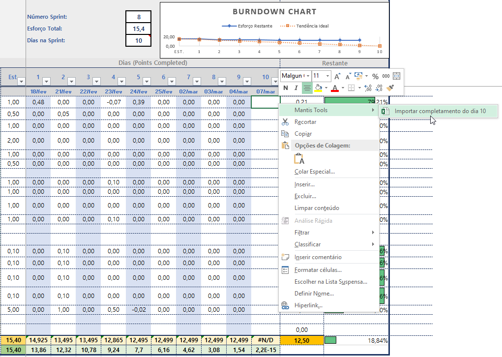

# MantisToolsSetup
MantisTools: Suplemento para MS-Excel que auxilia na importação dos completamentos percentuais da evolução de tarefas.

# Instalação

Utilizar o arquivo `Setup.exe` para iniciar a instalação.

Processo de instalação

Processo de desinstalação

# Exportação: Mantis

# Importação: MS Excel

Menu de importação do XML referente ao dia da Sprint. Será importado apenas o `Completamento`, percentual da evolução das tarefas atribuídas.

  
Finalização do processo de importação e completamento

